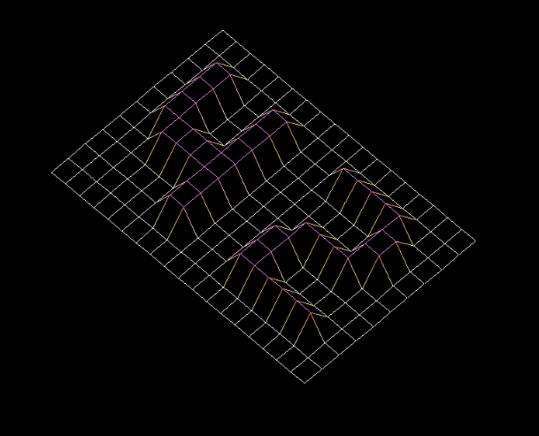

# FdF

**Project Instructions**

| Specs  | Explanation |
| ------------- | ------------- |
| Program name | fdf |
| Turn in files | Makefile, \*.h, \*.c |
| Makefile | NAME, all, clean, fclean, re |
| Arguments | A file in format \*.fdf |
| External functs. | - open, close, read, write,   malloc, free, perror,   strerror, exit   - All functions of the math library   - All functions of the MiniLibX   - ft_printf and any equivalent YOU coded |
| Libft authorized | Yes |
| Description  |  This project is about creating a simple wireframe model of a landspace. |

This project is about creating a simple wireframe model representation of a 3D land-space by linking various point (x, y, z) thanks to line segments (edges).

Your project must comply with the following rules:

- You must use the MiniLibX. Either the version avaliable on the school machines, or installing it using its sources.
- You have to turn in a Makefile which will compile your source files. It must not relink.
- Global variables are forbidden.
