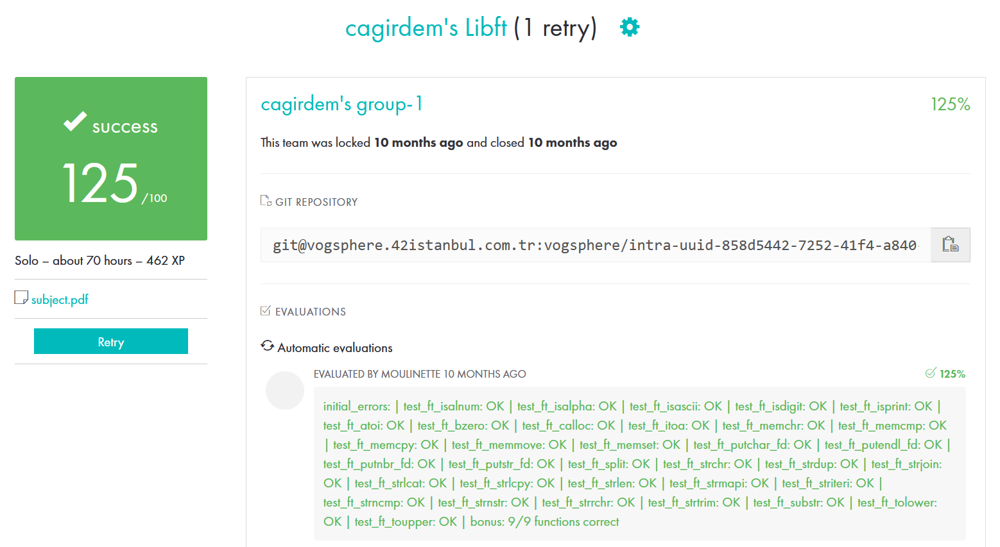

# Libft functions 

<svg xmlns="http://www.w3.org/2000/svg" viewBox="0 0 576 512"><!--! Font Awesome Pro 6.2.1 by @fontawesome - https://fontawesome.com License - https://fontawesome.com/license (Commercial License) Copyright 2022 Fonticons, Inc. --><path d="M549.655 124.083c-6.281-23.65-24.787-42.276-48.284-48.597C458.781 64 288 64 288 64S117.22 64 74.629 75.486c-23.497 6.322-42.003 24.947-48.284 48.597-11.412 42.867-11.412 132.305-11.412 132.305s0 89.438 11.412 132.305c6.281 23.65 24.787 41.5 48.284 47.821C117.22 448 288 448 288 448s170.78 0 213.371-11.486c23.497-6.321 42.003-24.171 48.284-47.821 11.412-42.867 11.412-132.305 11.412-132.305s0-89.438-11.412-132.305zm-317.51 213.508V175.185l142.739 81.205-142.739 81.201z"/></svg>

from string.h

## from string.h

| Function  | Explanation |
| ------------- | ------------- |
| ft_isalnum | checks if a character is alphanumeric |
| ft_isalpha | checks if a character is alphabetic |
| ft_islower | checks is a character is lowercase |
| ft_isupper | checks is a character is uppercase |
| ft_isdigit | checks is a character is a digit |
| ft_tolower | converts a character to lowercase |
| ft_toupper | converts a character to uppercase |
| ft_atoi | converts a byte string to an integer value |
| ft_strlen | returns the length of a given string |
| ft_strncmp | compares a certain amount of characters of two strings |
| ft_strchr | finds the first occurrence of a character |
| ft_strrchr | finds the last occurence of a character |
| ft_strdup | allocates a copy of a string |
| ft_memchr | searches an array for the first occurrence of a character |
| ft_memcmp | compares two buffers |
| ft_memset | fills a buffer with a character |
| ft_memcpy | copies one buffer to another |
| ft_memmove | moves one buffer to another |
  

 from stdlib.h 

  
## from stdlib.h
  
| Function  | Explanation |
| ------------- | ------------- |
| ft_calloc | allocates and zeroes memory |
| ft_malloc | allocates memory |

 Other Functions 

  
## Other Functions
  
| Function  | Explanation |
| ------------- | ------------- |
| ft_itoa | converts an integer value to a byte string |
| ft_substr | cuts a string from start point to specified length |
| ft_strtrim | trims a string |
| ft_split | splits a string use a specified delimeter character |

 Linked List Functions 

  
## Linked List Functions
  
| Function  | Explanation |
| ------------- | ------------- |
| ft_lstnew | creates a new linked list |
| ft_lstsize | turns linked list size |
| ft_lstlast | turns last linked list element |
| ft_lstiter | iterates all linked list elements and applies specified a function to every elements |
| ft_lstdelone | deletes a linked list element | 
| ft_lstclear | deletes all linked list elements | 
| ft_lstadd_front | adds a element at front of the linked list | 
| ft_lstadd_back | adds a element at back of the linked list |
  

